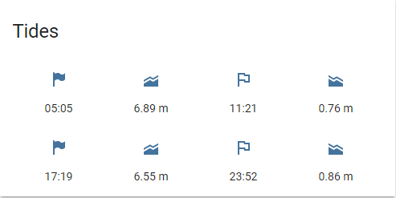

# Tides

## Install and config

Dependencies needed:

```bash
pip install bs4

#Alpine Linux
#apk add py3-beautifulsoup4
```

```bash
cd /share
git clone https://github.com/rianoc/tides.git
cd tides
cp config.py.example config.py
```

Edit `config.py` to replace `URL` which you can find on [tidetimes.org.uk](https://www.tidetimes.org.uk)
You can also change `LOCATION` and not use `/share`.

```bash
crontab -e
```

```bash
0 6 * * * python3 /share/tides/getTides.py
```

Add sensors to `configuration.yaml`

```yaml

sensor 9:
  platform: command_line
  name: High Tide 1 Time
  command: "python3 /share/tides/tides.py | grep 'High' | cut -d ',' -f2 | sed -n '1p'"
  
sensor 10:
  platform: command_line
  name: High Tide 1 Height
  command: "python3 /share/tides/tides.py | grep 'High' | cut -d ',' -f3 | sed 's/.$//' | sed -n '1p'"
  unit_of_measurement: "m"

sensor 11:
  platform: command_line
  name: Low Tide 1 Time
  command: "python3 /share/tides/tides.py | grep 'Low' | cut -d ',' -f2 | sed -n '1p'"

sensor 12:
  platform: command_line
  name: Low Tide 1 Height
  command: "python3 /share/tides/tides.py | grep 'Low' | cut -d ',' -f3 | sed 's/.$//' | sed -n '1p'"
  unit_of_measurement: "m"
  
sensor 13:
  platform: command_line
  name: High Tide 2 Time
  command: "python3 /share/tides/tides.py | grep 'High' | cut -d ',' -f2 | sed -n '2p'"
  
sensor 14:
  platform: command_line
  name: High Tide 2 Height
  command: "python3 /share/tides/tides.py | grep 'High' | cut -d ',' -f3 | sed 's/.$//' | sed -n '2p'"
  unit_of_measurement: "m"

sensor 15:
  platform: command_line
  name: Low Tide 2 Time
  command: "python3 /share/tides/tides.py | grep 'High' | cut -d ',' -f2 | sed -n '2p'"

sensor 16:
  platform: command_line
  name: Low Tide 2 Height
  command: "python3 /share/tides/tides.py | grep 'High' | cut -d ',' -f3 | sed 's/.$//' | sed -n '2p'"
  unit_of_measurement: "m"
```

To customise icons:

```yaml
homeassistant:
  customize: !include customize.yaml
```

Then in `customize.yaml`:

```yaml
sensor.high_tide_1_height:
  icon: mdi:elevation-rise
sensor.high_tide_1_time:
  icon: mdi:flag-variant
sensor.low_tide_1_height:
  icon: mdi:elevation-decline
sensor.low_tide_1_time:
  icon: mdi:flag-outline
sensor.high_tide_2_height:
  icon: mdi:elevation-rise
sensor.high_tide_2_time:
  icon: mdi:flag-variant
sensor.low_tide_2_height:
  icon: mdi:elevation-decline
sensor.low_tide_2_time:
  icon: mdi:flag-outline
```

For display on the UI as:



```yaml
      - type: glance
        entities:
          - entity: sensor.high_tide_1_time
          - entity: sensor.high_tide_1_height
          - entity: sensor.low_tide_1_time
          - entity: sensor.low_tide_1_height
          - entity: sensor.high_tide_2_time
          - entity: sensor.high_tide_2_height
          - entity: sensor.low_tide_2_time
          - entity: sensor.low_tide_2_height
        show_state: true
        show_icon: true
        show_name: false
        columns: 4
        title: Tides
```
